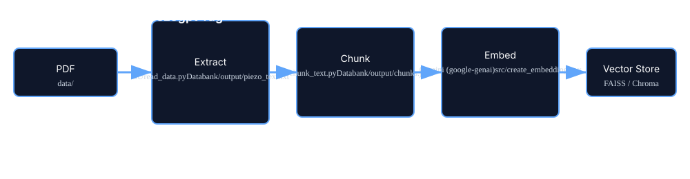

# piezogpt-rag

A small Python RAG (Retrieval-Augmented Generation) pipeline built around a single PDF ("Linear Theory of Piezoelectricity"). It extracts text from the PDF, splits it into chunks, and is set up to create embeddings (via Google Gemini) and a vector store so you can build a retriever-powered chatbot.

## Stack
- **Language(s):** Python (3.x)
- **Runtime / style:** Simple script-based pipeline (no web framework)
- **Notable libraries:** PyMuPDF (fitz) for PDF extraction, langchain_text_splitters for chunking, google-genai (Gemini client) for embeddings, python-dotenv for environment config

## Project layout

```
.github/                     GitHub workflow/config (repo metadata)
Databank/                    Storage for extracted data and outputs
  output/                    output files (piezo_text.txt, chunks.json)
data/                        source PDFs (e.g. Linear Theory of Piezoeletricity.pdf)
src/                         core scripts
  read_data.py               extract text from PDF -> Databank/output/piezo_text.txt
  chunk_text.py              split extracted text into chunks -> Databank/output/chunks.json
  create_embeddings.py       (placeholder) create embeddings from chunks using model API
  vector_store.py            (placeholder) build / query vector store
  retriever.py               (placeholder) retriever logic to fetch relevant chunks
  chatbot.py                 (placeholder) glue to generate answers using retrieved context
  list_models.py             example: list Gemini models using GEMINI_API_KEY
  test_gemini.py             simple Gemini API usage example
README.md                    this file
requirements.txt.txt         Python dependencies (rename to requirements.txt)
```

How it fits together:
- src/read_data.py extracts all pages from the PDF into a single text file with page markers under Databank/output/.
- src/chunk_text.py splits that text into smaller chunks (800 token-ish chunks with overlap) and saves them as chunks.json.
- The next steps (create embeddings, store vectors, and query via a retriever/chatbot) are scaffolded by the remaining scripts (create_embeddings.py, vector_store.py, retriever.py, chatbot.py). Examples for interacting with Google Gemini appear in test_gemini.py and list_models.py.

## Visuals & diagrams

Below are visual assets added to help you understand and present the project. They are stored under `assets/diagrams/` and render directly on GitHub.

Pipeline overview:



Repository architecture & data flow:


## Quickstart — run the pipeline locally

1. Clone the repo
   ```
   git clone https://github.com/Nicolaspwilde/piezogpt-rag.git
   cd piezogpt-rag
   ```

2. Install dependencies
   - The repository contains `requirements.txt.txt`. Rename it and install:
   ```
   mv requirements.txt.txt requirements.txt   # optional but recommended
   pip install -r requirements.txt
   ```
   - If you don't have a requirements file yet, at minimum install:
   ```
   pip install python-dotenv PyMuPDF langchain-text-splitters google-genai
   ```

3. Add your environment variables
   - Create a `.env` at the repo root with:
   ```
   GEMINI_API_KEY=your_google_gemini_api_key_here
   ```
   - The scripts use `dotenv` to load this for API calls (see src/test_gemini.py and src/list_models.py).

4. Extract text from the PDF
   - Make sure `data/Linear Theory of Piezoeletricity.pdf` is present.
   ```
   python src/read_data.py
   ```
   - Output: Databank/output/piezo_text.txt

5. Chunk the extracted text
   ```
   python src/chunk_text.py
   ```
   - Output: Databank/output/chunks.json

6. (Next steps — embedding & retrieval)
   - Implement or run `src/create_embeddings.py` to convert `chunks.json` to embeddings using Gemini.
   - Build or load a vector store in `src/vector_store.py`.
   - Wire up `src/retriever.py` and `src/chatbot.py` for query-time retrieval + generation.

7. Test Gemini connectivity
   ```
   python src/test_gemini.py
   ```
   - This prints a short response from the configured Gemini model.

## Files of interest
- src/read_data.py — PDF → text extraction (uses PyMuPDF)
- src/chunk_text.py — text → chunks.json (uses langchain_text_splitters.RecursiveCharacterTextSplitter)
- src/test_gemini.py, src/list_models.py — examples for using google-genai / Gemini
- Databank/output/ — script outputs (piezo_text.txt, chunks.json)

## Notes & recommendations
- Rename `requirements.txt.txt` to `requirements.txt` to follow conventions.
- Add error handling around missing files and missing env vars in the scripts before production use.
- Consider adding a small wrapper CLI (or Makefile / justfile) to chain steps: extract -> chunk -> embed -> build store -> serve.
- Add a LICENSE and a short CONTRIBUTING.md if you expect outside contributions.

## Example .env template
```
GEMINI_API_KEY=sk-...
```

## Try asking
- "Can you add a minimal create_embeddings.py that calls Gemini for each chunk in Databank/output/chunks.json and writes embeddings to Databank/output/embeddings.json?"
- "How should vector_store.py store embeddings locally (FAISS vs Chroma) for this project?"
- "Can you implement a simple chatbot.py that loads the vector store and answers a user question using Gemini with top-5 retrieved chunks?"
